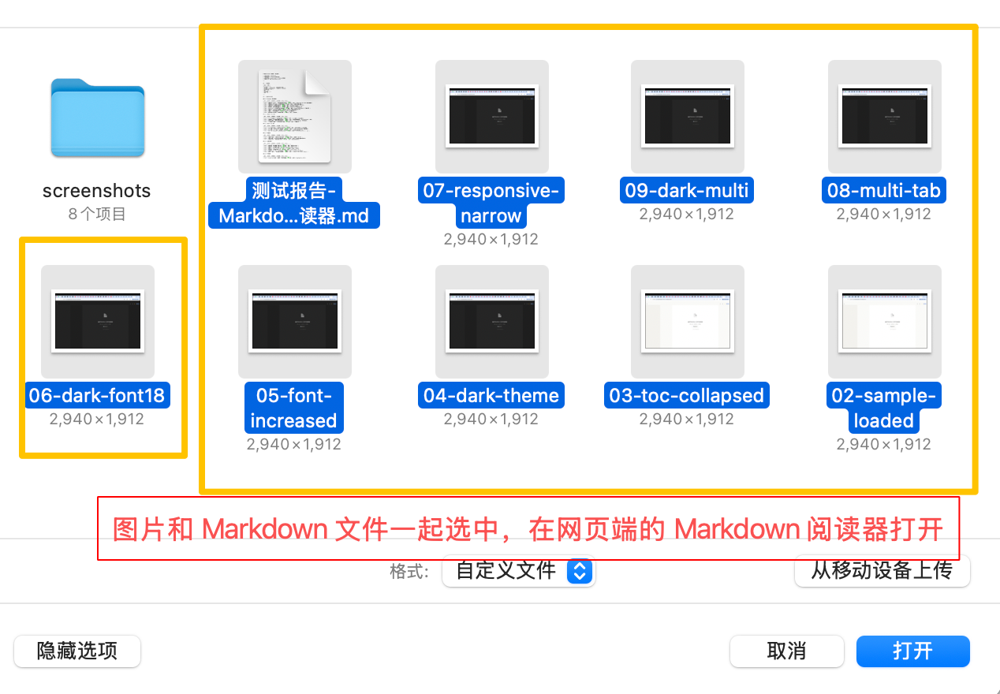
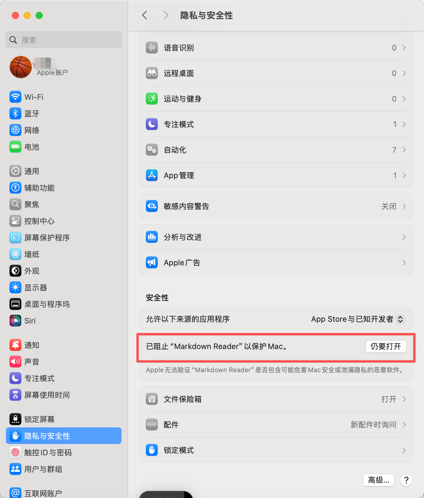

# Markdown Reader

Markdown Reader 是一个用来打开、预览和阅读本地 Markdown 文件的轻量工具。

它提供网页端和 macOS 桌面端两种使用方式，适合快速预览 `.md`、`.markdown`、`.txt` 文件，尤其适合阅读包含目录、代码块、表格、任务列表和公式的 Markdown 文档。

## 功能亮点

- 本地打开 Markdown 文件并即时预览
- 支持多标签页，同时阅读多个文件
- 自动生成目录侧栏，滚动时同步高亮
- 支持亮色/暗色主题切换
- 支持 A- / A+ 调整字号
- 支持表格自适应宽度，长链接和长路径自动换行
- 刷新页面后自动恢复已打开的文件会话
- 支持 KaTeX 公式、代码高亮、任务列表

## 网页端

网页端适合不想安装应用、只想临时预览 Markdown 文件的场景。它是一个纯静态页面，用户打开网页后就可以在浏览器里选择本地 Markdown 文件进行预览。

网页端入口：

```text
https://yan329689-bot.github.io/markdown-reader/
```

### 网页端怎么使用

1. 打开网页端地址
2. 点击右上角“打开”按钮
3. 选择本地 `.md` / `.markdown` / `.txt` 文件
4. 页面会立即渲染 Markdown 内容
5. 可以使用目录侧栏、主题切换、字号调整等功能辅助阅读

如果 Markdown 里引用了本地相对路径图片，例如：

```markdown

```

网页端需要在同一次文件选择中把 Markdown 文件和对应图片文件一起选中，或一起拖进页面。浏览器出于安全限制，不能在只选择一个 Markdown 文件时自动读取同目录下的其他图片文件。

推荐操作方式：

1. 点击右上角“打开”
2. 在文件选择窗口中同时选中 Markdown 文件和它引用的图片文件
3. 如果图片在文件夹里，也把对应图片文件一起选中
4. 点击“打开”，网页端会把这些图片临时映射到当前阅读会话中

示意图：



### 网页端可以做什么

- 点击“打开”按钮选择本地 Markdown 文件
- 拖拽 `.md` / `.markdown` / `.txt` 文件到页面中打开
- 上传 Markdown 文件后立即预览内容
- 支持显示同一次选择/拖拽进来的本地图片资源
- 查看自动生成的目录侧栏
- 调整字号、切换主题
- 刷新页面后恢复当前打开的文件内容

### 隐私说明

网页端读取文件发生在浏览器本地。用户通过文件选择器打开的 Markdown 内容不会被本应用上传到服务器。

浏览器出于安全限制，不能像桌面端一样随意读取电脑上的任意文件路径，这是正常行为。

### 本地预览网页端

```bash
python3 -m http.server 4173 --directory dist
```

然后访问：

```text
http://127.0.0.1:4173
```

### 部署到 Vercel

项目已包含 `vercel.json`，Vercel 会直接发布 `dist/` 目录。

通过 GitHub 导入 Vercel 时：

- Framework Preset: Other
- Install Command: 空
- Build Command: 空
- Output Directory: `dist`

也可以参考 [DEPLOY.md](./DEPLOY.md)。

## 桌面端

桌面端适合经常阅读本地 Markdown 文件的用户。它基于 Electron，可以作为 macOS 应用安装到“应用程序 / Applications”，之后可以从启动台或 Spotlight 直接打开。

桌面端会按 Markdown 文件所在目录自动解析本地相对图片路径，例如 `images/demo.png`、`./assets/a.jpg`。

### 本地开发运行

```bash
npm install
npm start
```

`npm start` 会自动移除 `ELECTRON_RUN_AS_NODE`，避免 Electron 被当成普通 Node.js 进程启动。

### 打包 macOS 应用

```bash
npm run build:mac:dmg
```

产物会生成在 `release/` 目录：

- `release/mac-arm64/Markdown Reader.app`
- `release/Markdown Reader-1.0.0-arm64.dmg`

### 安装桌面端

推荐使用 DMG 安装包：

1. 在 GitHub Release 中下载 `Markdown Reader-1.0.0-arm64.dmg`
2. 双击打开 DMG
3. 把 `Markdown Reader.app` 拖到 Finder 左侧的“应用程序 / Applications”
4. 打开启动台或 Spotlight，搜索 `Markdown Reader`

### macOS 首次打开安全提示

当前安装包没有 Apple Developer ID 签名，也没有 notarization 公证。原因是发布者暂未申请付费 Apple Developer Program 账号，因此应用无法被 macOS 自动识别为“已知开发者”发布的软件。

这不代表应用一定有问题，但 macOS 会出于安全策略阻止它直接打开。首次打开时，macOS 可能提示：

```text
Apple 无法验证 “Markdown Reader” 是否包含可能危害 Mac 安全或泄漏隐私的恶意软件。
```

如果你信任这个应用，需要手动允许一次：

1. 打开 Finder
2. 进入“应用程序 / Applications”
3. 找到 `Markdown Reader.app`
4. 按住 `Control` 键并点击应用，或使用触控板双指轻点
5. 选择“打开”
6. 如果系统仍然拦截，进入“系统设置 > 隐私与安全性”
7. 在“安全性”区域找到被阻止的 `Markdown Reader`
8. 点击“仍要打开”
9. 再次确认“打开”

系统设置中的“仍要打开”位置大致如下：



之后通常就可以从启动台正常打开。这个操作只需要首次安装后做一次。

## 项目结构

```text
dist/       网页端静态文件
electron/   Electron 主进程和 preload
release/    本地打包产物，不提交到 Git
```

## 技术栈

- Electron
- markdown-it
- KaTeX
- highlight.js
