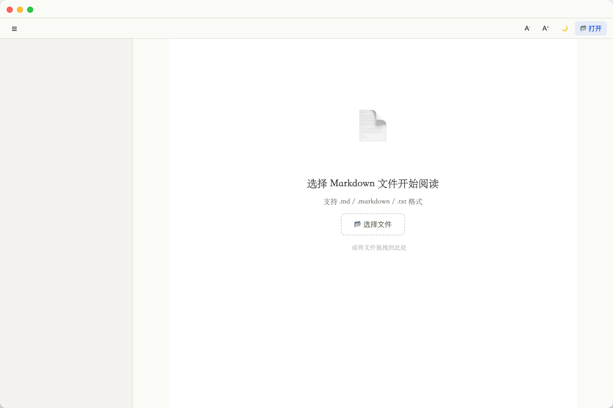
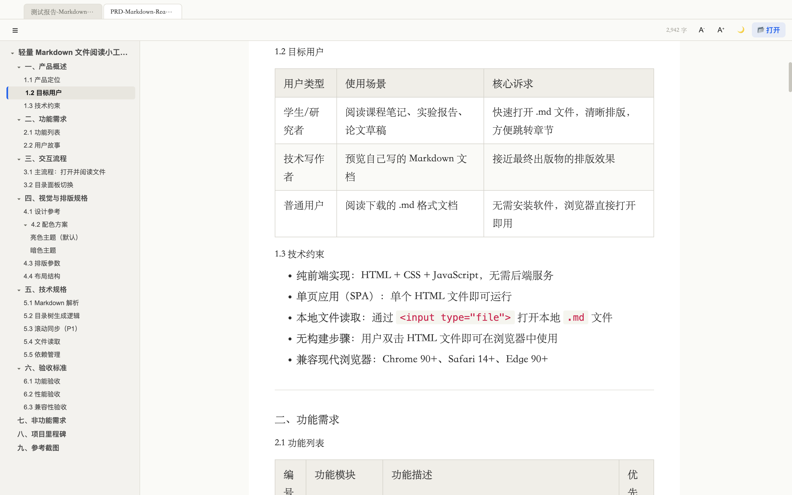

# Markdown Reader

Markdown Reader 是一个用来打开和阅读 Markdown 文件的轻量阅读器。

它提供网页端和 macOS 桌面端。你可以用它预览 `.md`、`.markdown`、`.txt` 文件，阅读带目录、代码块、表格、图片和公式的 Markdown 文档。

## 功能亮点

- 打开本地 Markdown 文件并即时预览
- 自动生成目录侧栏，方便快速跳转章节
- 支持多标签页，同时阅读多个文件
- 支持亮色/暗色主题切换
- 支持 A- / A+ 调整字号
- 表格、长链接、长路径会自动适配页面宽度
- 支持代码高亮、任务列表、公式和本地图片

## 界面预览

打开应用后，可以选择或拖入 Markdown 文件：



阅读文档时，可以使用目录侧栏、多标签页、字号调节和主题切换：



## 网页端

网页端适合临时阅读 Markdown 文件，不需要安装软件。

访问地址：

[https://md-reader-lemon.vercel.app](https://md-reader-lemon.vercel.app)

使用方式：

1. 打开网页端地址。
2. 点击右上角“打开”。
3. 选择本地 `.md` / `.markdown` / `.txt` 文件。
4. 页面会立即显示 Markdown 内容。

### 网页端图片说明

如果 Markdown 里引用了本地图片，例如：

```markdown

```

网页端需要你在同一次选择中，把 Markdown 文件和对应图片文件一起选中，或一起拖进页面。这是浏览器的安全限制：网页不能在你只选择 Markdown 文件时，自动读取电脑上同目录的其他图片。

示意图：


文件只会在你的浏览器本地读取，本应用不会把 Markdown 内容上传到服务器。

## 桌面端（推荐）

桌面端适合经常阅读本地 Markdown 文件的用户。安装后可以从启动台、Spotlight 或“应用程序”里直接打开。

下载地址：

[GitHub Release - Markdown.Reader-1.0.0-arm64.dmg](https://github.com/yan329689-bot/markdown-reader/releases/download/v1.0.0/Markdown.Reader-1.0.0-arm64.dmg)

安装方式：

1. 下载 `Markdown.Reader-1.0.0-arm64.dmg`。
2. 双击打开 DMG。
3. 把 `Markdown Reader` 拖到 `Applications` 文件夹。
4. 打开启动台，搜索并启动 `Markdown Reader`。

桌面端可以自动识别 Markdown 文件旁边的本地图片，例如 `images/demo.png`、`./assets/a.jpg`。

### macOS 首次打开提示

当前应用还没有申请 Apple Developer ID 签名和公证，所以 macOS 首次打开时会提示无法验证开发者。这是未签名应用的正常安全提示。

如果你信任这个应用，可以这样打开：

1. 第一次从启动台打开 `Markdown Reader`。
2. 看到系统提示后，点“完成”。
3. 打开“系统设置 > 隐私与安全性”。
4. 在“安全性”区域找到 `Markdown Reader`。
5. 点击“仍要打开”。
6. 在随后弹出的确认框里点击“打开”。

“仍要打开”的位置如下：


完成一次信任后，之后通常可以直接从启动台打开。
